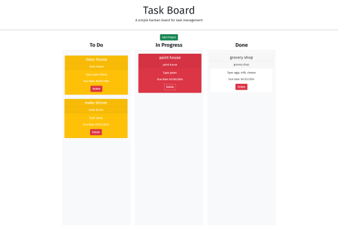

# Task-Board


## Description
This project asked to create a functioning Kandan board (to-do list) with a title,date, and description of the task.
This project asked for a working modal, so once the "add project" button was clicked a form would appear to fill out
the following; title, date, and description. Once added to the board 
the new card should be placed and moved to the appropriate location based on urgency with a waking delete button
to remove a task. We were lastly asked to keep this data in the local storage so once refreshed the task will 
stay on the refreshed page until deleted.

.

```md

```



# Links

[Live URL]https://github.com/meg-an321/Task-Board

[GitHub]